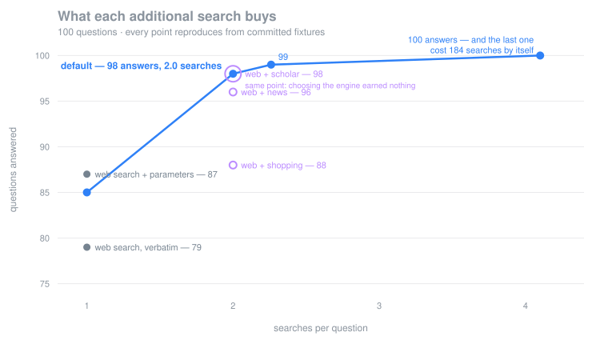

# Frugal

**A cost-aware search planner for SerpApi.**

On 100 benchmark questions, a plan answers **98** where a plain web search
answers **79** — for two searches a question. More than that, it can tell you
what the *next* search is worth before you buy it:



**98 answers cost 2.0 searches each. 99 costs 2.3. 100 costs 4.1 — and that
hundredth answer costs 184 searches by itself.** No other number this project
produced is as useful as that curve, because a recall percentage cannot tell
anyone whether to spend the next call and this can.

Most agents search badly. They take a question, fire a single query at one
engine, take the top ten results, and stuff them into a context window. When
that fails they fire another query, and another, until something sticks or the
budget is gone — and nothing anywhere tells them what it cost.

Frugal treats retrieval as a planning problem. Given a question and an explicit
budget, it compiles a *search plan*: which of SerpApi's engines to call, with
which query shaped for each, under a ceiling the caller sets — then executes it
and reports what it spent.

Every figure here replays from committed fixtures with no API key and no spend,
**including the ones that went against the design.** The purple ring on that
chart is the control: pairing web search with `google_scholar` for every
question, whatever it is about, lands on the identical 98 answers at the
identical cost. On this question set, choosing the engine per question earns
nothing measurable — and the benchmark that says so is in this repository. See
[Results](#results).

## What an agent gets from this

Frugal ships as an integration, not just a library. It plugs into
[MCP](#using-it-from-an-agent-mcp), [LangChain](#langchain) and
[LlamaIndex](#llamaindex), and adds one thing none of them otherwise have:

**an agent can see what a search costs, and cap it.**

Every existing way an agent reaches SerpApi hands back results and says nothing
about the price. The agent cannot tell whether a question was cheap, cannot cap
what it is willing to spend, and cannot find out beforehand. It searches, and
someone gets the bill.

| tool | what it does |
|---|---|
| `frugal_plan` | which engines a question would reach and the most it could cost — **issuing nothing** |
| `frugal_search` | runs the plan under a caller-set budget, and reports what it actually spent |

Results come back with provenance attached, so a chain citing its sources can
name the search that produced a claim rather than asserting it.

**Two ceilings, because one was not enough.** Each call is capped at 25
searches, and the process as a whole is capped at 200 — configurable with
`FRUGAL_SESSION_BUDGET`. The per-call cap alone does not stop an agent in a
loop, which is the case it was written for: a hundred calls at twenty-five
apiece is two and a half thousand searches. Every response also carries the
session total, because a caller who can only see one call's cost cannot manage a
budget across many. Cache hits consume neither ceiling; the allowance bounds
money, and a cached search cost none.

## Why this exists

SerpApi bills per search. Every wasted call is real money, and naive agents
waste a great many of them:

- **Redundant searches.** The same query, reformulated slightly, returns
  substantially the same page. Nobody notices because nobody is counting.
- **Wrong engine.** A question about a paper goes to web search when
  `google_scholar` would have answered it in one call.
- **No stopping rule.** An agent that has already found the answer keeps
  searching, because nothing tells it the evidence has saturated.

Each of those is a planning failure, and each is measurable.

## How it works

```
question
   │
   ├─ classify ──────▶ what kind of question is this?
   │
   ├─ route ─────────▶ which engines can answer it, at what cost?
   │
   ├─ reformulate ───▶ which query variants are worth issuing?
   │
   ├─ execute ───────▶ under a hard budget, concurrently
   │                     │
   │                     └─ saturation check: is new evidence still arriving?
   │                            └─ no ──▶ stop early, return the budget
   │
   └─ normalised, deduplicated, provenance-tagged evidence
```

Every stage is separately testable and separately ablatable, which is what makes
the benchmark able to attribute the improvement to a specific mechanism rather
than to the system as a whole.

## The cache is load-bearing

Frugal records every SerpApi response to disk, addressed by a hash of the engine
and its canonicalised parameters. This is not an optimisation:

- **Each unique search is paid for once, ever.** Parameter order, `None` values
  and credentials are normalised out of the key, so two spellings of the same
  search do not bill twice.
- **Benchmarks re-run at zero cost.** In replay mode the cache serves only from
  disk and raises on a miss rather than silently reaching for the network — so a
  recorded fixture set either covers a workload completely or fails loudly.
- **Results reproduce without an API key.** The fixtures behind the results
  table are committed. Clone the repository and re-run the benchmark; you should
  get the same numbers, having spent nothing.

Credentials never reach disk: they are stripped from both the key derivation and
the stored record.

## Results

One hundred questions with verifiable answers, scored on whether the retrieved
evidence contains the answer. Scoring is string matching against marker terms on
word boundaries, so there is no judge model and nothing to take on trust. Every
number below replays from committed fixtures without an API key.

| strategy | what it adds | answered | recall | searches/question |
|---|---|---|---|---|
| naive | the question verbatim to web search | 79/100 | 79% | 1.0 |
| keyword | + reformulation | 73/100 | 73% | 1.0 |
| parameterised | + engine parameters | 87/100 | 87% | 1.0 |
| **planned** | + routing, under a budget | **98/100** | **98%** | 2.0 |

Four strategies, each adding one mechanism to the one before, so that every gap
isolates a single thing. It took three revisions to get there: two strategies
could not separate reformulation from routing, and three could not separate
routing from the engine parameters that come with it.

One of the 98 is a false positive, described under [Limitations](#limitations).
It is left in rather than quietly corrected, because the correction would mean
editing a question's answer key after seeing which way it scored.

### Which mechanism earns what

Five mechanisms. Three decide what gets retrieved and are measured below; two
are governors — a budget and a stopping rule — which bound a run rather than
improve it, and are shown working [further down](#the-budget-and-the-stopping-rule-shown-firing).

| mechanism | net | what it costs |
|---|---|---|
| engine parameters | **+14** | nothing |
| taking a second search | **+11** | +1.0 searches/question |
| reformulation | **−6** | nothing |
| routing's choice of engine | **0** | — |

**Reformulation loses six questions.** Stripping a question to keywords helps an
index that matches terms and hurts one that parses intent. Asked *"Who proposed
the Adam optimisation algorithm?"*, web search returns an answer box naming
Kingma; asked `proposed adam optimisation algorithm`, it returns pages about
Adam. The interrogative was carrying the meaning.

It ships anyway, and the reason is visible in the per-engine data rather than in
this total: `google_shopping`, `google_jobs`, `google_maps` and `google_trends`
match terms rather than sentences, and sending them a sentence returns nothing.
Reformulation is applied per engine because engines differ; the measured −6 is
the price of applying it to web search too, and the honest reading is that this
arm should probably be conditional. It is not, and the table says so.

**Engine parameters earn the most of any single mechanism.** `gl`, `hl`,
`location`, `geo` and `as_ylo` were added because sending none of them was a
correctness bug — a question about interest in electric vehicles *in India* was
being answered with worldwide data. They turn out to be worth fourteen questions,
and they cost nothing, because a parameter rides along with a search already
being issued.

On 57 of the 100 questions the parameterised arm builds a request byte-identical
to the keyword arm, because no locale or recency constraint applies. The +14 is
earned on the other 43.

**Taking a second search earns eleven.** This is the routing machinery's real
contribution, and it is not the part that chooses.

### Is the routing doing the work?

The obvious objection is that any second engine would do. That deserves a
control, so the benchmark runs fixed pairings: web search plus the *same* second
engine for every question, whatever the question is about.

| configuration | answered | recall | searches/question |
|---|---|---|---|
| naive — verbatim question | 79/100 | 79% | 1.0 |
| keyword — reformulated, one engine | 73/100 | 73% | 1.0 |
| parameterised — reformulated, with parameters | 87/100 | 87% | 1.0 |
| routed to one engine, **no web search** | 83/100 | 83% | 1.0 |
| web + a fixed second engine (shopping) | 88/100 | 88% | 2.0 |
| web + a fixed second engine (news) | 96/100 | 96% | 2.0 |
| web + a fixed second engine (scholar) | **98/100** | 98% | 2.0 |
| **web + the routed second engine** | **98/100** | **98%** | **2.0** |

**Routing ties the best fixed pairing exactly**, on the same number of searches,
and they answer the *identical* 98 questions — not merely the same count. On
this question set, choosing the engine per question earns nothing measurable
over always choosing `google_scholar`.

That is the control doing its job, and the result is not the one this project
set out to show. The honest statement:

> The router selects a specialist engine on 54 of the 100 questions, and that
> selection produces better-shaped evidence — a demand series rather than an
> article about one. It does not produce more answers. What produced the answers
> was deciding to search a second time at all.

Routing finds no specialist signal on 34 questions — *"Who invented the
telephone?"* is not a places question or a jobs question. It used to search once
and stop, which cost six answers to save 34 searches. It now falls back to a
broad index. Three alternatives were measured on the six questions where that
fallback decides the outcome:

| fallback | rescued |
|---|---|
| `google_scholar` | **6 / 6** |
| `google_news` | 4 / 6 |
| a second web query, reworded | 2 / 6 |
| `google_shopping` | 1 / 6 |
| `bing`, the verbatim question | 1 / 6 |
| `bing`, the keyword query | 0 / 6 |

Two things follow. **Asking somewhere else beats asking again** — rewording
recovered two, and on 15 of the 34 questions it could not even produce a second
phrasing, since stripping *"What is the capital of Karnataka?"* leaves two words
and no alternative. And **the index has to be broad**: `google_shopping` is
narrow and behaves accordingly.

`bing` is the surprise. Asked the verbatim question, with the request confirmed
correct in the response's own `bing_url`, it returned Cambridge Dictionary and
Merriam-Webster entries for *"created"* and *"wrote"* — 263,000 results, and the
word "mendeleev" nowhere in the payload.

The rule and the preference order were written down before any of these were
scored, because choosing whichever engine won would be fitting the router to the
benchmark. The reasoning is in
[`router.py`](src/frugal/router.py): a question reaching the fallback is a plain
factual one, rarely about this week, so it wants the least time-bound general
index.

### What more searches buy

The default is not the highest-scoring configuration. It is the one that returns
the most answers per search.

| plan size | answered | searches/question | answers/search | the next answer costs |
|---|---|---|---|---|
| 1 engine, 1 round | 83/100 | 1.0 | 0.83 | — |
| **2 engines, 1 round** — the default | **98/100** | **2.0** | **0.49** | 5.7 searches |
| 3 engines, 1 round | 99/100 | 2.3 | 0.44 | 26 searches |
| 3 engines, 2 rounds | **100/100** | 4.1 | 0.24 | **184 searches** |

**One hundred out of one hundred is reachable**, with `--engines 3 --rounds 2`,
and it costs twice the searches. The last answer costs 184 searches on its own,
because the deeper plan searches every question again in order to help two.

That curve is the product. A single recall figure tells a user nothing about
whether to buy the next search; this tells them exactly. The default stops at two
because the 99th and 100th answers are not worth doubling a bill — but that is a
judgement, and the flag is there for anyone who judges differently.

### Questions a web page should not have answered

The hundred are questions web search can answer, which is why routing's choice
of engine does not distinguish itself on them. A separate, smaller set was
written to find questions where the specialist engine is the only one that can
serve: places with their street addresses, the organisations named on a patent
record, two search-interest series compared. Committed before being run, scored
by the same rules, reported separately rather than folded into the hundred.

| strategy | answered | searches/question |
|---|---|---|
| **naive** — verbatim question | **8/8** | **1.0** |
| keyword | 5/8 | 1.0 |
| parameterised | 7/8 | 1.0 |
| planned | 8/8 | 2.0 |

**The premise was wrong.** Plain web search answered all eight, at half the
planner's cost. Indian directory sites publish hospital, pharmacy and ATM
addresses as ordinary web pages, so asking for a street address does not require
a maps index after all.

Across all 108 questions, the specialist engine was decisive exactly once —
`patents-perovskite-assignees`, where `google_patents` answered and the
reformulated web query did not. Eight questions is far too few to conclude much,
and the set is kept because a benchmark that only contains cases the project wins
is not a benchmark.

### Which kind of evidence came back

| strategy | time series returned |
|---|---|
| naive | 0 |
| keyword | 0 |
| planned | 12 |

Twelve questions ask whether something is rising or falling. Both baselines
answer them in prose and count as answered; the planner also returns a demand
series that can be plotted, dated and compared. Asked whether interest in millets
exceeds quinoa, it returns both series — 37.0 against 50.0 — which is an answer
no web page publishes as data.

This is **stated as a fact about which engines were called, not scored as a
result.** Only `google_trends` produces a series and only the routed strategy
calls it, so a score here would report the configuration rather than measure
anything. An earlier version did score it, out of thirty, and quoted the figure
as the project's sturdiest claim. It was not a claim at all.

### Do later rounds know what earlier ones found?

Yes, and without a model. After each round, the results so far are mined for
vocabulary the question never contained, and the next round's queries carry it.
This is pseudo-relevance feedback, and it keeps the plan deterministic: the same
evidence yields the same terms, so a plan that adapts still reproduces exactly.

The clearest case is `isro-latest-mission`. The question asks about "the latest
ISRO mission launch" and does not name the mission. Round one's results do, and
round two asks about `eos` — the mission designation — which no rewording of the
question could have produced.

Morphological variants are excluded, because they are not new vocabulary. An
earlier version nominated "launches" for a question about a "launch", and
"crispr" for a question about "CRISPR-Cas9", which spends a search to ask what
was already asked.

A second round is worth two questions and doubles the bill, which is why the
default is one round. See the curve above.

### The budget and the stopping rule, shown firing

Neither fires anywhere in the benchmark, which is recorded under
[Limitations](#limitations). That is a fact about the question set rather than
about the code, and the difference is worth demonstrating rather than asserting,
so both are reproduced here against a transport that charges. This needs no key
and no network:

```bash
python scripts/demo_governors.py
```

**The budget refuses the search that would exceed it.**

```
plan wants     : 6 searches
budget given   : 2
issued         : 2        skipped: 4
SerpApi billed : 2
stopped        : budget exhausted
```

The third step is never issued and the remaining four are handed back. It does
not fire on the benchmark because the limit is 12 and a plan spends 2 — and it
*cannot* fire in replay at any limit, because replay serves from cache, a cache
hit is free, and an allowance that bounds money is not consumed by a search that
cost none. A replayed run at `--budget 1` executing its whole plan is that rule
working, not failing.

**The stopping rule stops when the next search would buy nothing.**

```
plan wants     : 3 searches
budget given   : 50        (deliberately not binding)
issued         : 2        skipped: 1
stopped        : stopped early: evidence saturated
novelty        : [0.00, 0.00]
```

The second batch returned nothing the first had not, so the third search was
never bought. It does not fire on the benchmark for a more interesting reason:
marginal novelty never falls. Each step queries a *different* index, and
Scholar's papers are not Google's pages, so 90 to 100% of every batch is new
even on a question that was answered by the first search. The signal the rule
watches for does not occur in a cross-engine plan. It occurs when one index is
queried repeatedly, which is what it was written for.

Raising the threshold until it fired would manufacture the result rather than
measure it, so the threshold is unchanged and this paragraph exists instead.

### Limitations

Worth reading before drawing conclusions from the tables above.

- **One of the 98 is a false positive.** `iitm-location` asks where IIT Madras
  is, and is satisfied by a sociology paper about caste in the IITs that happens
  to contain both "chennai" and "iit madras". It is disclosed rather than fixed,
  because the fix would be editing that question's markers after seeing how it
  scored, and this file would then be reporting a number chosen for its size.
- **Routing's choice of engine earns nothing measurable here**, as the fixed
  pairings show. It earns better-shaped evidence and one question in 108. A
  question set with more flight prices, share prices and map pins would test it
  properly; this one does not have them.
- **Reformulation is net negative and ships anyway.** −6 on web search, and
  necessary for the term-matching engines. It should probably be conditional on
  the engine. It is not.
- **Two of the five mechanisms never fire** on this benchmark, though both are
  shown working above against a transport that charges. They are the two
  *governors* — a budget and a stopping rule — rather than two of the three that
  earn recall, and a circuit breaker is not judged by how often it trips. Across 200 plan runs, every single
  one reports "completed the plan": not once does the budget bind, and not once
  does the stopping rule stop anything. The budget is 12 and a plan spends 2. The
  stopping rule looks for new evidence to stop arriving, and it never does,
  because each step queries a *different* index — 90 to 100% of every batch is
  new. The mechanism is sound for repeatedly querying one index; on a
  cross-engine plan its signal does not occur. Raising the threshold until it
  fired would manufacture the result rather than measure it.
- **Deep plans waste half their spend.** At 3 engines and 2 rounds, 196 of 410
  searches go to questions already answered at search two — because nothing stops
  them. That is the cost of the previous item, measured.
- **Scoring is lexical.** Markers match on word boundaries, which fixed the worst
  of it, but a correct answer phrased without any listed marker still scores as a
  miss, and a page mentioning a marker incidentally still scores as a hit.
- **The cost report is a lower bound.** Over one session this project recorded
  760 billed searches while SerpApi's own counter showed 817. A request that
  reaches SerpApi is a search SerpApi runs, whether or not the response arrives,
  so `searches_charged` undercounts by however much a run fails or retries. The
  client now reports requests sent alongside searches recorded, so the gap is
  visible from inside the tool rather than only from the dashboard.
- **Routing is lexical.** Three failure modes of that are handled — a signal word
  inside a name ("Steve Jobs biography"), a signal shortly after a negation ("not
  recent news"), and ambiguous words admitted only in unambiguous phrasings
  ("work as", never bare "work"). Others certainly remain.
- **Eight engines of SerpApi's hundred-odd are profiled.** Flights, hotels and
  finance are not, and those are precisely the questions where no web page has
  the answer — live prices. Their absence is why the routing control has so
  little to distinguish.
- **Google News is partitioned by country edition**, and place detection is
  lexical, so a question naming an Indian subject without naming India queries
  the wrong edition and returns nothing.
- **Deduplication compares URLs**, so one story syndicated across four outlets
  counts as four pieces of evidence.
- **Place detection uses a curated list** weighted towards India. An unlisted
  town is not detected; the query still carries the name, so the engine is no
  worse off.

### Reproducing this

The recorded responses are committed, so this needs no API key and spends
nothing:

```bash
python -m frugal.benchmark --replay --cache benchmarks/fixtures
python -m frugal.benchmark --replay --cache benchmarks/fixtures --ablate
python -m frugal.benchmark --replay --cache benchmarks/fixtures \
    --questions benchmarks/structured.json
```

Replay fails loudly on a missing fixture rather than skipping it, so the
committed set either covers the workload completely or says it does not.

The question sets, including the reasoning behind each question, are in
[benchmarks/questions.json](benchmarks/questions.json) and
[benchmarks/structured.json](benchmarks/structured.json). Twenty-five of the
hundred are ordinary factual questions that plain web search answers perfectly
well; they are there because a set the planner wins outright would be a set
chosen to make it win.

## Using it

```bash
frugal plan "Which companies are hiring Python developers in Chennai?"
```

Shows the routing scores, the query shaped for each engine, the parameters each
one receives, and what the whole thing would cost — without issuing anything.
Knowing the price before agreeing to pay it is the point.

```bash
frugal ask "Has search interest in electric vehicles in India been rising?"
```

Runs it. The cost counter ticks as searches are billed, cache hits are marked
free, and the stopping rule says why it stopped. A time series is drawn as a
sparkline, because it is the one kind of evidence a web search cannot return:

```
1. electric vehicles india
   ▁▁▁▁▁▁▃▄▄▄▅█▆▅▄▄▅▄▅▆▄▄▄▄▃▃▃▄▃▃▃▂▄▄▄▄▃▃▃▃▂▃▃▂▁▂▁▂▁▁▁▁▁
   53 observations, min 17, max 100, trending down (-6%)
```

Everything printed is the planner's own trace rather than decoration: the
routing scores are what selected the engines, the counter is the budget
governor, and the saturation line is the stopping rule explaining itself.

Add `--replay --cache benchmarks/fixtures` to run either command against the
committed fixtures, with no API key and no spend.

### Answering, rather than retrieving

```bash
frugal ask "..." --answer
```

Writes an answer from the evidence, citing it by number. This needs a
`GROQ_API_KEY` in your `.env` — a free one is at
[console.groq.com/keys](https://console.groq.com/keys) — and everything else
works without it.

It sits deliberately outside everything the benchmark measures. Routing,
reformulation, budgeting and the stopping rule are all deterministic so that the
result table reproduces without a key or a model, and a model anywhere in that
path would destroy the property. Synthesis runs after the plan has finished,
reads only what the plan retrieved, and changes no number in the results table.

Three things are enforced rather than requested. The model sees only the
retrieved evidence, so an answer invented from memory has nothing to cite.
Citations are checked against the evidence actually supplied, and invented ones
are stripped rather than shown as references a reader cannot follow. And an
answer that cites nothing is labelled as ungrounded, because an uncited answer
is either a refusal — which is fine — or the model's own memory, which is not.

## Using it from an agent (MCP)

Most search tools an agent can reach hand back ten links and say nothing about
what that cost. The agent cannot tell whether a question was cheap, cannot cap
what it is willing to spend, and cannot find out beforehand. It just searches,
and someone gets the bill.

Frugal exposes an MCP server with the two tools that change that:

| tool | what it does |
|---|---|
| `frugal_plan` | which engines a question would reach, and the most it could cost — **issuing nothing** |
| `frugal_search` | runs the plan under a budget the caller sets, and reports what it spent alongside what it found |

```bash
pip install 'frugal[mcp]'
```

Then point any MCP client at it — Claude Desktop, Cursor, or your own agent:

```json
{
  "mcpServers": {
    "frugal": {
      "command": "frugal-mcp",
      "env": {
        "SERPAPI_API_KEY": "your-key-here"
      }
    }
  }
}
```

A search comes back with its cost attached:

```json
{
  "evidence": [ ... ],
  "cost": {
    "searches_billed": 2,
    "served_from_cache": 0,
    "steps_planned": 2,
    "steps_skipped_by_early_stop": 0
  },
  "engines_used": ["google", "google_trends"],
  "stopped_because": "completed the plan"
}
```

Every evidence item carries the engine and query that produced it, so an agent
can cite a claim rather than assert it. Budgets are capped server-side at 25
searches per call whatever the caller asks for: an agent looping on a tool is
the usual way a search bill becomes a surprise.

Set `FRUGAL_REPLAY=1` and `FRUGAL_CACHE_DIR=benchmarks/fixtures` to run the
server entirely from committed fixtures, with no key and no spend.

### LangChain

```bash
pip install 'frugal[langchain]'
```

A retriever that drops in where a vector store would go, and two tools an agent
can choose between:

```python
from frugal.langchain import build_retriever, frugal_tools

retriever = build_retriever(budget=6)
docs = retriever.invoke("Which companies are hiring Python developers in Chennai?")

docs[0].metadata["engine"]     # which engine produced this
docs[0].metadata["plan_cost"]  # what the retrieval spent

agent_tools = frugal_tools()   # frugal_plan and frugal_search
```

Every document carries the engine, query and rank that produced it, so a chain
citing its sources can name the search rather than assert the claim. The first
document carries the plan's cost, which a list of documents does not otherwise
tell you.

`frugal_plan` is the tool worth having: an agent can ask what a question would
cost before deciding to spend it. Both tools cap the budget server-side at 25
searches per call whatever the caller asks for.

### LlamaIndex

```bash
pip install 'frugal[llamaindex]'
```

```python
from frugal.llamaindex import build_retriever, frugal_tools

retriever = build_retriever(budget=6)
nodes = retriever.retrieve("Which companies are hiring Python developers in Chennai?")

nodes[0].node.metadata["engine"]     # which engine produced this
nodes[0].node.metadata["plan_cost"]  # what the retrieval spent

agent_tools = frugal_tools()         # frugal_plan and frugal_search
```

Same two shapes in LlamaIndex's containers, and the same cap — a test asserts
the three integrations share one budget ceiling, so a caller cannot route around
it by picking a framework.

One caveat worth stating: LlamaIndex expects a relevance score per node, and a
planner has no similarity to report — there is no embedding and no distance. The
score is reciprocal rank, which preserves the order the engines returned and is
honest about being ordinal. It is not a confidence.

## Install

Requires Python 3.11 or newer.

```bash
git clone https://github.com/desilva23/frugal.git
cd frugal
python3 -m venv .venv
source .venv/bin/activate
pip install -e ".[dev]"
```

Then add your SerpApi key. A free key gives 250 searches per month, which is
enough to try it:

```bash
cp .env.example .env
```

Open `.env` and replace the placeholder with your key from
[serpapi.com/manage-api-key](https://serpapi.com/manage-api-key):

```
SERPAPI_API_KEY=your-actual-key
```

`.env` is gitignored, so the key is never committed. Confirm the setup:

```bash
frugal doctor
```

## Reproducing the benchmark

The recorded fixtures are committed, so this needs no key and spends nothing:

```bash
pytest                                                    # test suite
python -m frugal.benchmark --replay --cache benchmarks/fixtures
```

To run it live against SerpApi instead, check the cost first:

```bash
python -m frugal.benchmark --dry-run     # projected spend, issues nothing
python -m frugal.benchmark               # the real thing
```

## Which SerpApi engines are used

Eight, out of the hundred-odd SerpApi offers: `google`, `google_news`,
`google_scholar`, `google_patents`, `google_shopping`, `google_jobs`,
`google_trends` and `google_maps`. Each carries cost, latency and volatility
metadata that the planner reads when deciding where a question should go and how
long its answer stays fresh. All eight bill one search per call, verified
against the account counter.

How often each is reached across the hundred questions:

| engine | questions |
|---|---|
| `google` | 99 |
| `google_scholar` | 47 |
| `google_trends` | 12 |
| `google_news` | 11 |
| `google_jobs` | 10 |
| `google_shopping` | 9 |
| `google_patents` | 8 |
| `google_maps` | 4 |

`google_scholar` is high because 34 of those are the fallback for questions with
no specialist signal, rather than a scholarly judgement.

**What is not served.** Flights, hotels and finance are not profiled, so a
question about a live fare, a room rate or a share price gets web search and
whatever it happens to carry. Those are the questions where routing would matter
most, since no web page holds the answer — which is a fair criticism of the
benchmark above, and is why it cannot show routing's engine choice earning
anything.

## Licence

MIT — see [LICENSE](LICENSE).
